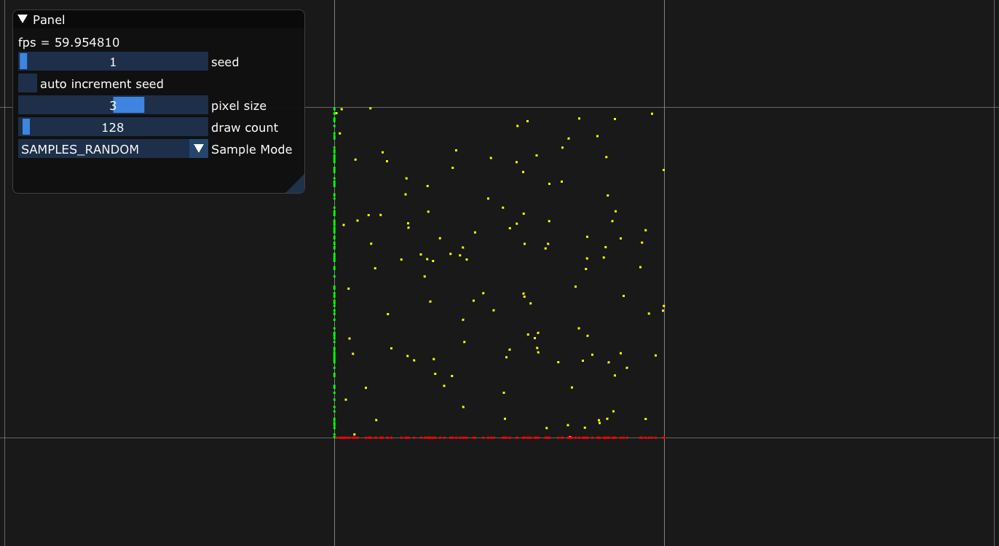
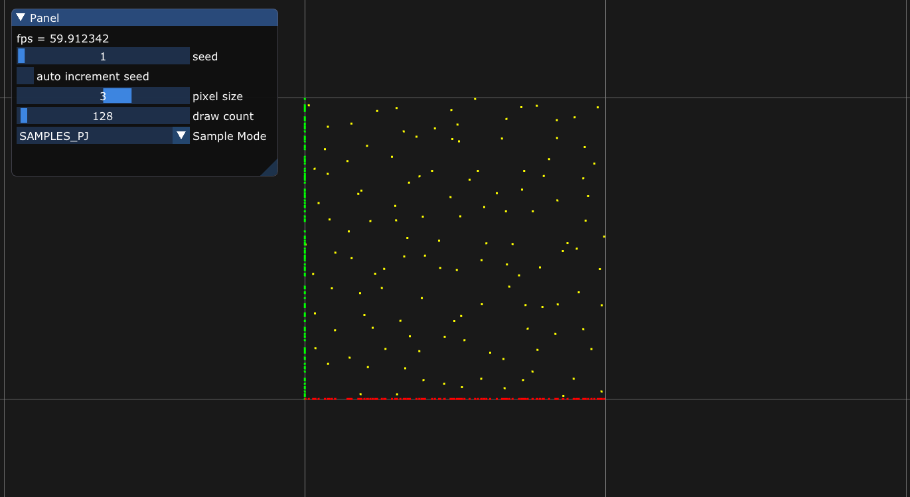
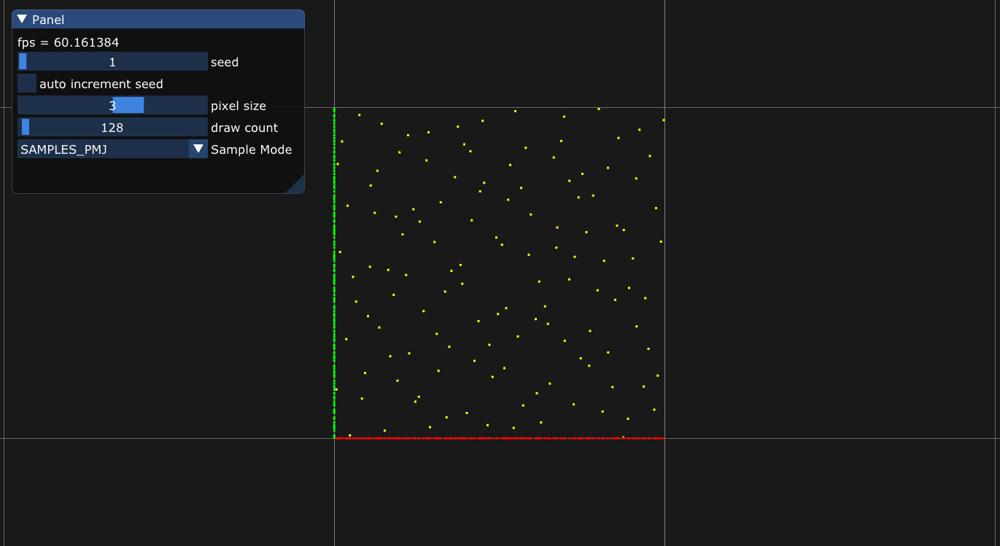
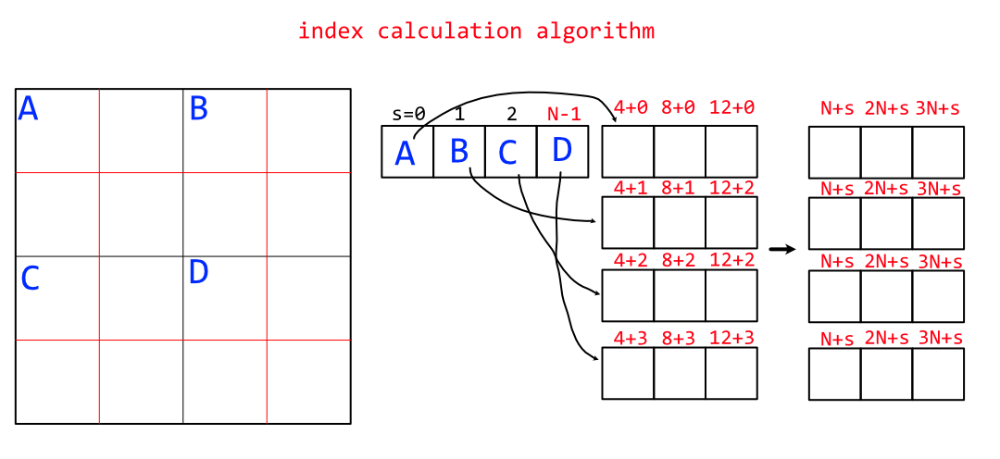
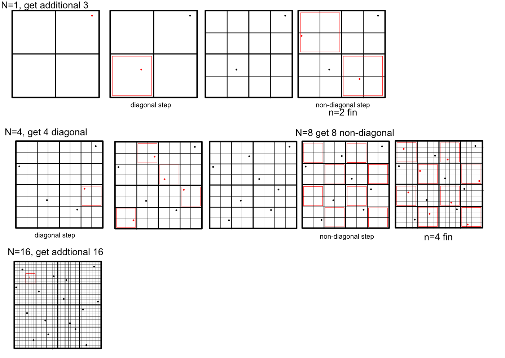

## Progressive Multi-Jittered Sample Sequences
- PJ
- PMJ

## How to run

```
git clone https://github.com/Ushio/ProgressiveMultiJitteredSampleSequences.git
git submodule update --init
```

## Visualize
Random ↓


PJ ↓


PMJ ↓


## Implementation notes



## Tips
- It'd be better to use integer for sample on PMJ implementation. Because the occupied stratum checking must be strict.

## references 
Per Christensen, Andrew Kensler, Charlie Kilpatrick, "Progressive Multi-Jittered Sample Sequences"

SIGGRAPH University 2019 Course - My Favorite Samples ( https://www.youtube.com/watch?v=bHDfETTS550 )
